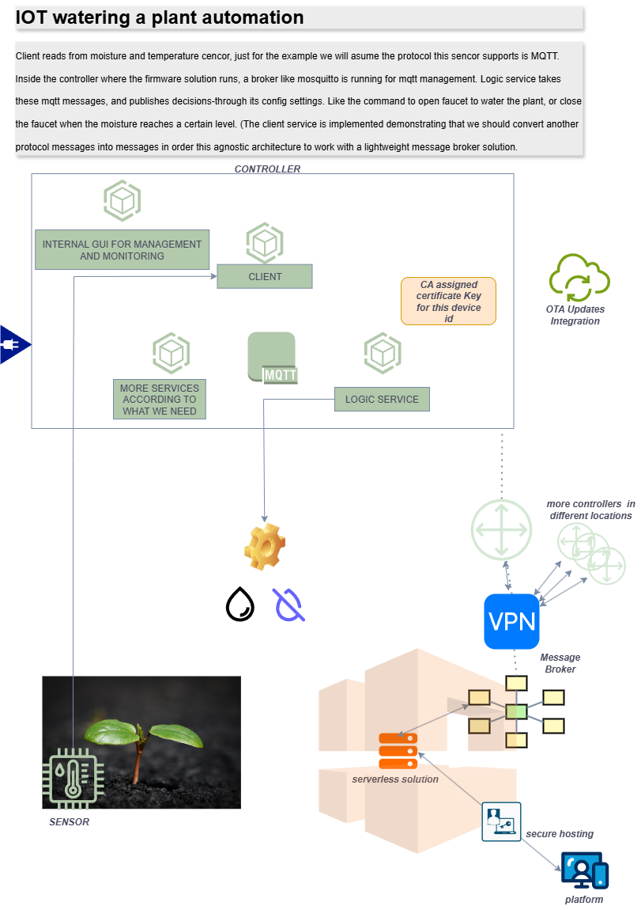

# IoT Plant Monitoring & Auto-Watering System

**A real-time IoT simulation demonstrating MQTT-based sensor monitoring, automated control systems, and web-based visualization for smart agriculture applications.**


> **🌱 Portfolio Showcase Notice**: This is an educational IoT system demonstrating real-world smart agriculture patterns. The system simulates plant sensors, implements automatic watering logic, and provides real-time monitoring through a web dashboard. It showcases IoT architecture, MQTT messaging, event-driven automation, and full-stack integration.

### 📺 Live Demo


*Real-time demonstration: Soil moisture drops naturally, controller detects low moisture, automatically activates faucet, moisture increases, faucet turns off at optimal level*

---

## 📋 Table of Contents

- [🎯 Project Overview](#-project-overview)
- [🚀 Quick Start (5 Minutes)](#-quick-start-5-minutes)
- [🏗 System Architecture](#-system-architecture)
- [✨ Key Features](#-key-features)
- [🛠 Technology Stack](#-technology-stack)
- [📡 MQTT Communication](#-mqtt-communication)
- [🎛 Controller Logic](#-controller-logic)
- [🔧 Simulator Details](#-simulator-details)
- [🎨 Web Dashboard](#-web-dashboard)
- [⚙️ Configuration](#-configuration)
- [🤝 Contributing](#-contributing)
- [🆘 Troubleshooting](#-troubleshooting)

---

## 🎯 Project Overview

### What is This System?

<div align="center">

</div>

This is a **complete IoT plant monitoring solution** that simulates a real smart agriculture setup. Imagine you have a potted plant that needs regular watering - this system automates that process by:

1. **Reading sensors** (soil moisture, temperature)
2. **Making intelligent decisions** (when to water based on thresholds)
3. **Controlling actuators** (turning water faucet on/off)
4. **Visualizing everything** in a real-time web dashboard

### Real-World Scenario

```
🌱 Your Plant:
   └─ Has soil moisture sensor
   └─ Has temperature sensor
   └─ Connected to automatic watering system

📊 The Problem:
   └─ Soil dries out over time
   └─ Manual watering is time-consuming
   └─ Over/under-watering damages plants

🤖 The Solution:
   └─ Sensors constantly monitor conditions
   └─ Controller decides when to water (moisture < 30%)
   └─ Faucet turns ON automatically
   └─ Water flows until optimal level reached (70%)
   └─ Faucet turns OFF automatically
   └─ You watch it all happen in real-time on your screen!
```

### Business Goals

- **Automate plant care** - Reduce manual watering by 100%
- **Optimize water usage** - Water only when needed
- **Prevent plant death** - Maintain healthy moisture levels
- **Enable remote monitoring** - Check plant status from anywhere
- **Demonstrate IoT patterns** - Showcase event-driven architecture

### Technical Objectives

This project demonstrates:

✅ **IoT & Messaging Patterns**
- MQTT pub/sub communication
- Event-driven architecture
- Sensor data collection
- Actuator control
- Real-time data streaming

✅ **Automated Control Systems**
- Threshold-based decision making
- Hysteresis control (prevent oscillation)
- State machine logic
- Feedback loops

✅ **Full-Stack Integration**
- Flask web server with WebSockets
- React-like dynamic UI
- Real-time data visualization
- Process orchestration

✅ **Clean Architecture**
- Modular design (GUI, Controller, Simulator)
- Separation of concerns
- Manager pattern for process lifecycle
- Configuration-driven behavior

---

## 🚀 Quick Start (5 Minutes)

### Prerequisites

Ensure you have installed:
- **[Python](https://www.python.org/)** (3.10+)
- **[Docker Desktop](https://www.docker.com/products/docker-desktop)** (for MQTT broker)
- **[Git](https://git-scm.com/)** for version control

### Installation Steps

#### 1. Clone the Repository

```bash
git clone https://github.com/YOUR_USERNAME/Showcase-IOT-grow-a-plant.git
cd Showcase-IOT-grow-a-plant
```

#### 2. Install Dependencies

**For GUI:**
```bash
cd grow-a-plant-gui
pip install -r requirements.txt
```

**For Controller:**
```bash
cd ../iot-grow-a-plant-controller
pip install -r requirements.txt
```

**For Simulator:**
```bash
cd ../mqtt-client-simulator
pip install -r requirements.txt
```

#### 3. Start the System

**Open the GUI (Port 5000):**
```bash
cd grow-a-plant-gui
python app.py
```

Open browser to: **http://localhost:5000**

#### 4. Use the Dashboard to Start Components

1. Click **"Start MQTT Broker"** - Starts message broker (Docker)
2. Click **"Start Simulator"** - Starts plant sensors simulation
3. Click **"Start Controller"** - Starts automated watering logic
4. **Watch the magic happen!** 🪄

The plant moisture will drop from 70% → 30%, then the controller will automatically turn on the faucet, water will flow, moisture increases back to 70%, and the faucet turns off!

#### 5. What You'll See

- **Real-time metrics** updating every 2 seconds
- **Moisture dropping** naturally over time (~35%/hour)
- **Automatic watering** when moisture hits 30%
- **Moisture increasing** +5% every 2 seconds while watering
- **Faucet status** showing ON/OFF
- **Plant health** score (0-100%)
- **Console logs** showing all MQTT messages

### Stop Everything

Just click the **Stop** buttons in the dashboard, or close the terminal.

---

## 🏗 System Architecture

### System Diagram

<div align="center">

</div>

*Complete system architecture showing MQTT broker, controller logic, sensor simulator, and web dashboard integration*

### High-Level Architecture

```
┌─────────────────────────────────────────────────────────────────┐
│                      WEB DASHBOARD (Port 5000)                   │
│  ┌────────────────────────────────────────────────────────┐     │
│  │         Flask + SocketIO + HTML/JS/CSS                 │     │
│  │  • Real-time Metrics Display                           │     │
│  │  • Process Control (Start/Stop)                        │     │
│  │  • Configuration Management                            │     │
│  │  • Manual Faucet Control                               │     │
│  │  • WebSocket Updates                                   │     │
│  └────────────────────────────────────────────────────────┘     │
└─────────────────────────────────────────────────────────────────┘
                              │
                ┌─────────────┼─────────────┐
                │             │             │
                ▼             ▼             ▼
┌─────────────────────┐  ┌──────────────────────┐  ┌─────────────────────┐
│   MQTT BROKER       │  │   PLANT CONTROLLER   │  │  SENSOR SIMULATOR   │
│   (Docker)          │  │   (Python Process)   │  │  (Python Process)   │
│                     │  │                      │  │                     │
│  • Mosquitto 2.0    │  │  • Subscribe Topics  │  │  • Publish Topics   │
│  • Port 1883        │  │  • Decision Logic    │  │  • Moisture Decay   │
│  • Pub/Sub Broker   │  │  • Faucet Control    │  │  • Temp Variation   │
│  • Message Routing  │  │  • Health Analysis   │  │  • Faucet Listener  │
│                     │  │  • State Machine     │  │  • Flow Simulation  │
└─────────────────────┘  └──────────────────────┘  └─────────────────────┘
         │                        │                          │
         └────────────────────────┴──────────────────────────┘
                              │
                    MQTT Topics (Pub/Sub)
                              │
        ┌─────────────────────┼─────────────────────┐
        │                     │                     │
        ▼                     ▼                     ▼
 ┌──────────────┐     ┌──────────────┐     ┌──────────────┐
 │ sensors/     │     │  plant/      │     │ faucet/      │
 │ ├─moisture   │     │  ├─health    │     │ └─command    │
 │ └─temperature│     │  ├─watering  │     │              │
 └──────────────┘     │  └─hours     │     └──────────────┘
                      └──────────────┘
```

### Component Interaction Flow

```
1. Simulator publishes sensor data
   └─> MQTT: sensors/soil_moisture = 28%

2. Controller receives data
   └─> Evaluates: 28% < 30% (threshold)
   └─> Decision: Turn ON faucet!
   └─> Publishes: faucet/command = "1"

3. Simulator receives faucet command
   └─> Sets: faucet_on = True
   └─> Calculates: moisture += 5% (per cycle)
   └─> Publishes: sensors/soil_moisture = 33%

4. Controller receives updated moisture
   └─> Evaluates: 33% < 70% (target)
   └─> Decision: Keep watering...

5. Eventually: moisture >= 70%
   └─> Controller: Turn OFF faucet!
   └─> Publishes: faucet/command = "0"

6. GUI updates in real-time
   └─> Displays all metrics
   └─> Shows faucet status
   └─> Updates plant health
```

### Design Patterns & Principles

#### 1. **Event-Driven Architecture**
- **Loose Coupling**: Components communicate via MQTT, don't know about each other
- **Asynchronous**: Non-blocking message passing
- **Scalable**: Add more sensors/actuators without changing code
- **Resilient**: Components can restart independently

#### 2. **Manager Pattern** (GUI Process Managers)
```python
# Each component has dedicated manager
class BrokerManager:
    def start() -> dict  # Start MQTT broker
    def stop() -> dict   # Stop broker

class SimulatorManager:
    def start() -> dict  # Launch simulator process
    def stop() -> dict   # Terminate simulator

class ControllerManager:
    def start() -> dict  # Launch controller process
    def stop() -> dict   # Terminate controller
```

Benefits:
- Centralized process lifecycle management
- Consistent error handling
- Easy testing and mocking
- Clean separation of concerns

#### 3. **Publisher-Subscriber Pattern** (MQTT)
```python
# Simulator publishes
mqtt.publish("sensors/soil_moisture", {"value": 45.5})

# Controller subscribes
@mqtt.subscribe("sensors/soil_moisture")
def handle_moisture(message):
    # Process sensor data
    pass
```

Benefits:
- One-to-many communication
- Dynamic topic subscription
- Message persistence
- Quality of Service (QoS) levels

#### 4. **State Machine** (Controller Logic)
```python
State: MONITORING
  └─> moisture < 30%
  └─> Transition to: WATERING
  └─> Action: Turn ON faucet

State: WATERING
  └─> moisture >= 70%
  └─> Transition to: MONITORING
  └─> Action: Turn OFF faucet
```

Benefits:
- Predictable behavior
- Prevents race conditions
- Easy to debug
- Clear state transitions

#### 5. **Modular Architecture**
```
Showcase-IOT-grow-a-plant/
├── grow-a-plant-gui/          # Web Interface
│   ├── app.py                 # Main Flask app
│   ├── broker_manager.py      # Broker lifecycle
│   ├── simulator_manager.py   # Simulator lifecycle
│   ├── controller_manager.py  # Controller lifecycle
│   ├── mqtt_handler.py        # MQTT communication
│   └── config_manager.py      # Configuration handling
│
├── iot-grow-a-plant-controller/ # Decision Logic
│   ├── main.py                  # Controller entry point
│   ├── src/monitors/            # Health analysis
│   └── grow_a_plant_config.json # Thresholds
│
└── mqtt-client-simulator/     # Sensor Simulation
    ├── simulator.py           # Simulator logic
    └── requirements.txt       # Dependencies
```

### Key Architectural Decisions

| Decision | Rationale | Benefits |
|----------|-----------|----------|
| **MQTT over HTTP** | Real-time, low-latency pub/sub messaging | Efficient, scalable IoT communication |
| **Docker for Broker** | No local installation required | Easy setup, consistent environment |
| **Flask + SocketIO** | Real-time web updates | Live dashboard without polling |
| **Subprocess Management** | Independent component lifecycles | Fault isolation, easy debugging |
| **JSON Configuration** | External config without code changes | Flexible threshold adjustment |
| **Modular Python Files** | Single responsibility principle | Maintainable, testable code |
| **Manager Pattern** | Centralized process control | Clean error handling, logging |

---

## ✨ Key Features

### Web Dashboard (Flask + SocketIO)

#### 🎛 Process Orchestration
- Start/Stop MQTT Broker (Docker container)
- Start/Stop Plant Simulator (Python process)
- Start/Stop Watering Controller (Python process)
- Real-time process status indicators
- Error handling and user feedback

#### 📊 Real-Time Monitoring
- Live soil moisture percentage (10-100%)
- Current temperature in Celsius
- Faucet status (ON/OFF) with visual indicator
- Plant health score (0-100%)
- Watering hours needed
- Last update timestamp
- WebSocket-based updates (no page refresh needed)

#### 💧 Manual Controls
- Manual faucet ON/OFF buttons
- Override automatic watering
- Safety checks (broker/simulator must be running)

#### ⚙️ Configuration Management
- Edit watering thresholds via web UI
- Adjust moisture low/optimal levels
- Modify temperature ranges
- Real-time config reload

### Plant Controller (Automated Logic)

#### 🧠 Intelligent Decision Making
- **Threshold-based control**: Water when moisture < 30%
- **Target-based stopping**: Stop when moisture >= 70%
- **Hysteresis**: Different ON/OFF thresholds prevent oscillation
- **Temperature consideration**: Factor in evaporation rates
- **Health scoring**: Calculate overall plant wellbeing

#### 📈 Metrics Publishing
- Plant health percentage (0-100%)
- Hours until watering needed (0-24h)
- Currently watering status (0 or 1)
- Comprehensive logging

#### 🔄 Automatic Watering Cycle
```
Monitor → Detect Low Moisture → Turn ON Faucet →
Water Flows → Moisture Increases → Target Reached →
Turn OFF Faucet → Monitor → Repeat
```

### Sensor Simulator (Realistic Behavior)

#### 🌡 Environmental Simulation
- **Moisture decay**: ~35% per hour (configurable)
- **Temperature variation**: ±3°C fluctuation
- **Temperature effects**: Higher temp = faster evaporation
- **Realistic flow rate**: 0.5 liters/second
- **Gradual watering**: +5% moisture per 2-second cycle

#### 📡 MQTT Publishing
- Publishes every 2 seconds
- JSON payloads with sensor values
- Timestamps for data tracking
- Reliable message delivery

#### 🎯 Faucet Response
- Listens to faucet/command topic
- Instantly responds to ON/OFF commands
- Updates moisture calculation mode
- Resets watering timestamp

### Code Quality

#### 🧹 Clean Code Practices
- **Type hints** throughout Python code
- **Docstrings** for all functions/classes
- **Error handling** with try-catch blocks
- **Logging** at appropriate levels
- **Modular design** with single responsibility

#### 🏗 Architecture Patterns
- Manager pattern for lifecycle
- Repository pattern for data access
- Dependency injection in Flask
- Configuration externalization

---

## 🛠 Technology Stack

### Backend Technologies

| Category | Technology | Version | Purpose |
|----------|-----------|---------|---------|
| **Framework** | Flask | 3.0+ | Web framework |
| **Real-time** | Flask-SocketIO | 5.3+ | WebSocket communication |
| **Language** | Python | 3.10+ | Programming language |
| **IoT Protocol** | MQTT (paho-mqtt) | 2.1+ | IoT messaging |
| **Message Broker** | Eclipse Mosquitto | 2.0+ | MQTT broker |
| **Container** | Docker | 20.10+ | Broker containerization |

### Frontend Technologies

| Category | Technology | Purpose |
|----------|-----------|---------|
| **HTML5** | Semantic markup | Structure |
| **CSS3** | Modern styling | Visual design |
| **JavaScript** | ES6+ | Interactivity |
| **SocketIO Client** | socket.io-client.js | WebSocket connection |

### IoT & Architecture

| Component | Technology | Purpose |
|-----------|-----------|---------|
| **Message Protocol** | MQTT | Lightweight pub/sub messaging |
| **Quality of Service** | QoS 0 | Fire-and-forget delivery |
| **Topics** | Hierarchical naming | Organized message routing |
| **Payload Format** | JSON | Structured data exchange |

---

## 📡 MQTT Communication

### Topic Structure

The system uses a hierarchical topic structure following MQTT best practices:

#### Published by Simulator
```
sensors/
├─ soil_moisture    # {"value": 45.5}
└─ temperature      # {"value": 22.3}
```

#### Published by Controller
```
plant/
├─ health           # {"value": 85}
├─ watering_hours   # {"value": 12.5}
└─ currently_watering  # {"value": 1}

faucet/
└─ command          # "1" or "0"
```

### Message Flow Examples

**Sensor Reading:**
```json
Topic: "sensors/soil_moisture"
Payload: {
  "value": 28.5
}
```

**Faucet Control:**
```json
Topic: "faucet/command"
Payload: "1"  (ON) or "0" (OFF)
```

**Plant Health:**
```json
Topic: "plant/health"
Payload: {
  "value": 75
}
```

### MQTT Connection Settings

```python
MQTT_HOST = "localhost"
MQTT_PORT = 1883
KEEPALIVE = 60 seconds
QOS_LEVEL = 0  # At most once delivery
```

---

## 🎛 Controller Logic

### Watering Algorithm

```python
# Controller Configuration
MOISTURE_LOW = 30      # Turn faucet ON below this
MOISTURE_TARGET = 70   # Turn faucet OFF above this
TEMP_LOW = 18°C
TEMP_HIGH = 28°C

# Decision Logic
if moisture <= MOISTURE_LOW and faucet_off:
    publish("faucet/command", "1")  # Turn ON
    faucet_on = True

elif moisture >= MOISTURE_TARGET and faucet_on:
    publish("faucet/command", "0")  # Turn OFF
    faucet_on = False
```

### Health Calculation

```python
def calculate_health(moisture, temperature):
    # Moisture Score (0-50 points)
    if moisture >= optimal:
        moisture_score = 50
    elif moisture >= low:
        moisture_score = 25 + ((moisture - low) / (optimal - low)) * 25
    else:
        moisture_score = (moisture / low) * 25

    # Temperature Score (0-50 points)
    if temp_low <= temperature <= temp_high:
        temp_score = 50  # Optimal range
    else:
        # Penalize deviation from range
        temp_score = calculate_temp_penalty(temperature)

    return int(moisture_score + temp_score)  # 0-100%
```

### Watering Hours Estimation

```python
def calculate_watering_hours(moisture, temperature):
    if moisture >= optimal:
        base_hours = 24  # Plant is happy
    elif moisture >= low:
        # Interpolate between optimal and low
        ratio = (moisture - low) / (optimal - low)
        base_hours = 12 + (ratio * 12)
    else:
        # Urgent watering needed
        base_hours = max(0, (moisture / low) * 12)

    # Adjust for temperature (heat accelerates drying)
    temp_factor = 1.0 + (temp - 22) * 0.05

    return round(base_hours * temp_factor, 1)
```

---

## 🔧 Simulator Details

### Plant State Model

```python
plant_state = {
    'last_watered': time.time(),
    'moisture_level': 70.0,      # Current moisture %
    'base_temperature': 22.0,     # Base temp °C
    'faucet_on': False,           # Faucet state
    'liters_per_second': 0.5      # Water flow rate
}
```

### Moisture Dynamics

**When Faucet is OFF (Drying):**
```python
# Natural evaporation + plant consumption
hours_since_watering = (now - last_watered) / 3600
moisture_loss_per_hour = 35.0 * temperature_factor
current_moisture = max(10, initial - (loss_per_hour * hours))
```

**When Faucet is ON (Watering):**
```python
# Water flowing in
moisture_increase_per_cycle = (liters_per_sec * 2) * 5  # +5% per 2sec
current_moisture = min(100, moisture + increase)
last_watered = now  # Reset timestamp
```

### Temperature Simulation

```python
# Temperature varies naturally
temperature = base_temperature + random.uniform(-2, +3)
# Example: 22°C base = 20-25°C range
```

### Update Cycle

```
Every 2 seconds:
  1. Check faucet status
  2. Calculate current moisture
  3. Calculate current temperature
  4. Publish to MQTT
  5. Log to console
```

---

## 🎨 Web Dashboard

### Dashboard Features

#### Status Panel
- **MQTT Broker**: Running/Stopped indicator with green/red badge
- **Simulator**: Running/Stopped indicator
- **Controller**: Running/Stopped indicator

#### Metrics Display
- **Soil Moisture**: Large percentage with visual indicator
  - Red: < 30% (critical)
  - Yellow: 30-60% (low)
  - Green: > 60% (optimal)
- **Temperature**: Celsius with thermometer icon
- **Plant Health**: Percentage score with health icon
- **Faucet Status**: ON/OFF with visual indicator
- **Watering Hours**: Time until next watering needed

#### Control Buttons
- Start/Stop MQTT Broker
- Start/Stop Simulator
- Start/Stop Controller
- Manual Faucet ON/OFF
- Edit Configuration

#### Real-Time Updates
- WebSocket connection for instant updates
- No page refresh required
- Smooth transition animations
- Console logs streaming

---

## ⚙️ Configuration

### Controller Configuration

**File**: `iot-grow-a-plant-controller/grow_a_plant_config.json`

```json
{
  "message_flows": [
    {
      "thresholds": {
        "moisture_low": 30,      // Turn faucet ON
        "moisture_optimal": 60,  // Target moisture
        "temp_low": 18,          // Min comfortable temp
        "temp_high": 28          // Max comfortable temp
      }
    }
  ]
}
```

**Edit via GUI**: Click "Edit Configuration" button in dashboard

### Simulator Configuration

**File**: `mqtt-client-simulator/simulator.py`

```python
plant_state = {
    'moisture_level': 70.0,        # Starting moisture %
    'base_temperature': 22.0,       # Base temperature °C
    'liters_per_second': 0.5,       # Water flow rate
}

# Adjustable constants
moisture_loss_per_hour = 35.0  # Drying rate %/hour
update_interval = 2  # Seconds between updates
```

### MQTT Configuration

**Host**: `localhost`
**Port**: `1883`
**Broker**: Eclipse Mosquitto (Docker)

---

## 🤝 Contributing

### Development Workflow

#### Setup Development Environment

```bash
# Clone repository
git clone https://github.com/YOUR_USERNAME/Showcase-IOT-grow-a-plant.git
cd Showcase-IOT-grow-a-plant

# Create virtual environments
cd grow-a-plant-gui && python -m venv venv && venv\Scripts\activate && pip install -r requirements.txt
cd ../iot-grow-a-plant-controller && python -m venv venv && venv\Scripts\activate && pip install -r requirements.txt
cd ../mqtt-client-simulator && python -m venv venv && venv\Scripts\activate && pip install -r requirements.txt
```

#### Running Individual Components

**GUI Only:**
```bash
cd grow-a-plant-gui
python app.py
# Open http://localhost:5000
```

**Simulator Only:**
```bash
# Start MQTT broker first
docker run -d --name mosquitto -p 1883:1883 eclipse-mosquitto

# Run simulator
cd mqtt-client-simulator
python simulator.py
```

**Controller Only:**
```bash
# Start MQTT broker first
# Start simulator
# Then run controller
cd iot-grow-a-plant-controller
python main.py
```

### Code Style Guidelines

**Python:**
- Follow PEP 8
- Use type hints
- Write docstrings
- Use meaningful variable names
- Keep functions small and focused

**JavaScript:**
- Use ES6+ features
- Semicolons optional but consistent
- Clear comments for complex logic
- Descriptive function names

### Adding New Features

**New Sensor:**
1. Add to simulator publishing loop
2. Add topic to controller subscriptions
3. Update GUI metrics display
4. Update documentation

**New Actuator:**
1. Add command topic in controller
2. Add listener in simulator
3. Add control button in GUI
4. Update state management

---

## 🆘 Troubleshooting

### Common Issues

#### MQTT Broker Won't Start

**Problem**: "Docker not found" error

**Solution**:
```bash
# Verify Docker is running
docker --version

# If not installed, install Docker Desktop
# https://www.docker.com/products/docker-desktop

# Manually start broker:
docker run -d --name plant-mqtt-broker -p 1883:1883 eclipse-mosquitto
```

#### Port Already in Use (5000)

**Problem**: Flask can't start on port 5000

**Solution**:
```bash
# Windows - Find and kill process
netstat -ano | findstr :5000
taskkill /PID <PID> /F

# Mac/Linux
lsof -ti:5000 | xargs kill
```

#### Simulator/Controller Not Starting

**Problem**: Process crashes immediately

**Solution**:
```bash
# Check logs in GUI console
# Or run manually to see errors:
cd mqtt-client-simulator
python simulator.py

# Common issues:
# - MQTT broker not running
# - Wrong Python version (need 3.10+)
# - Missing dependencies (pip install -r requirements.txt)
```

#### No Data Updating

**Problem**: Dashboard shows no metrics

**Solution**:
1. Verify MQTT broker is running (green badge)
2. Verify simulator is running (green badge)
3. Check browser console for WebSocket errors
4. Refresh page (F5)
5. Check Flask console logs

#### Controller Not Watering

**Problem**: Moisture drops but faucet doesn't turn on

**Solution**:
1. Check controller is running
2. Verify moisture threshold: should be < 30%
3. Check controller logs for decision logic
4. Verify MQTT messages are flowing (check console)
5. Restart controller

### Testing MQTT Manually

```bash
# Subscribe to all topics
mosquitto_sub -h localhost -t "#" -v

# Publish test message
mosquitto_pub -h localhost -t "sensors/soil_moisture" -m '{"value": 25}'

# See faucet commands
mosquitto_sub -h localhost -t "faucet/command"
```

### Debug Mode

Enable verbose logging in each component:

**Simulator**: Already logs each iteration
**Controller**: Check `logger.py` settings
**GUI**: Flask debug mode enabled by default

---

## 📊 Project Statistics

- **Lines of Code**: ~3,000+ (Python + JavaScript + HTML/CSS)
- **Components**: 3 independent processes
- **MQTT Topics**: 7 unique topics
- **Configuration Options**: 4 adjustable thresholds
- **Real-time Updates**: Every 2 seconds
- **Watering Cycle Time**: ~16 seconds (30% → 70%)

---

## 🎯 Key Takeaways for Recruiters

This project demonstrates:

1. **IoT Architecture**: Real-world sensor/actuator communication patterns
2. **Event-Driven Design**: MQTT pub/sub messaging and reactive systems
3. **Full-Stack Skills**: Backend (Flask), Frontend (HTML/JS), DevOps (Docker)
4. **Clean Code**: Modular design, manager pattern, separation of concerns
5. **Real-Time Systems**: WebSocket integration, low-latency updates
6. **Automation Logic**: State machines, threshold-based control, feedback loops
7. **Documentation**: Comprehensive, clear, human-readable

### Skills Showcased

✅ **IoT & Embedded**
- MQTT protocol
- Sensor simulation
- Actuator control
- Real-time data streaming

✅ **Backend Development**
- Flask framework
- WebSocket (SocketIO)
- Process management
- Subprocess orchestration

✅ **Frontend Development**
- Dynamic HTML/JavaScript
- Real-time UI updates
- Responsive design
- User experience

✅ **DevOps & Infrastructure**
- Docker containerization
- Process lifecycle management
- Configuration management
- Logging and monitoring

✅ **System Design**
- Event-driven architecture
- Pub/sub messaging
- State machines
- Modular design

---

## 🔗 Resources & Documentation

### Technologies Used

**Core Frameworks & Libraries:**
- [Flask](https://flask.palletsprojects.com/) - Python web framework
- [Flask-SocketIO](https://flask-socketio.readthedocs.io/) - WebSocket support for Flask
- [Paho MQTT](https://www.eclipse.org/paho/index.php?page=clients/python/index.php) - Python MQTT client library

**IoT & Messaging:**
- [Eclipse Mosquitto](https://mosquitto.org/) - Open-source MQTT broker
- [MQTT Protocol](https://mqtt.org/) - Lightweight messaging protocol for IoT

**Development Tools:**
- [Docker](https://www.docker.com/) - Container platform
- [Python](https://www.python.org/) - Programming language (3.10+)

### Useful Links

- 📖 [MQTT Beginner's Guide](https://www.hivemq.com/mqtt-essentials/)
- 🎓 [IoT Architecture Patterns](https://docs.aws.amazon.com/iot/latest/developerguide/iot-architecture.html)
- 🔧 [Flask Tutorial](https://flask.palletsprojects.com/en/2.3.x/tutorial/)
- 📚 [Python Asyncio Documentation](https://docs.python.org/3/library/asyncio.html)

---

## 📄 License

This project is licensed under the MIT License - see the [LICENSE](LICENSE) file for details.

---

## 👤 Author

**Dimitris Alexakis**

For questions, collaboration, or job opportunities, please reach out via:
- GitHub: [@dalexaki](https://github.com/dalexaki)
- LinkedIn: [Dimitris Alexakis](https://www.linkedin.com/in/dimitris-alexakis-803b48230/)
- Email: [de.alexaki@gmail.com](mailto:de.alexaki@gmail.com)

---

## 🌟 Acknowledgments

- Eclipse Mosquitto team for the excellent MQTT broker
- Flask and SocketIO developers for the web framework
- The open-source community for inspiration and tools

---

<div align="center">

**⭐ If you found this project helpful, please consider giving it a star!**

Made with ❤️ for IoT enthusiasts and job recruiters

</div>
